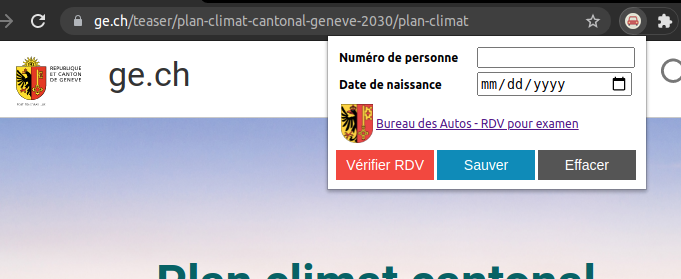
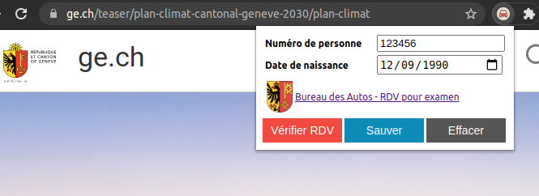
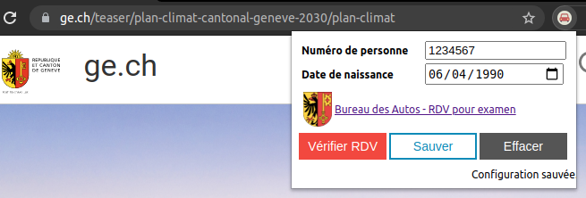
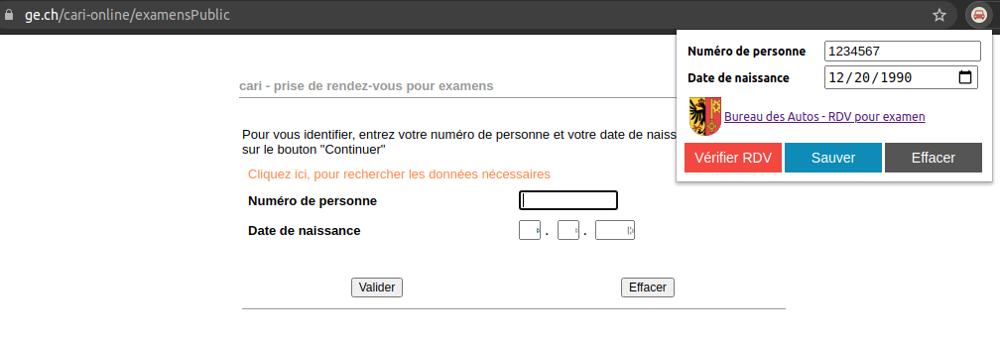
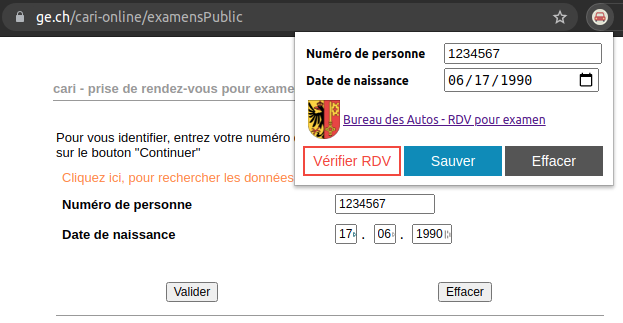

# ge-permis-voiture-rdv

## Qu'est-ce que c'est?

Ce programme est une petite extension pour Google Chrome visant à se simplifier la vie.

Cette extension permet d'automatiser la recherche d'une **date d'examen pratique pour un permis de conduire dans le Canton de Genève**, en Suisse.

Il y a généralement plusieurs mois de délais avant tout examen, il est donc important de s'inscrire au plus tôt...
Au moment d'écrire ces lignes (juin 2021), les prochaines places libres sont fin décembre 2021. C'est-à-dire dans 6 mois.

Heureusement, il a y régulièrement des gens qui annulent ou déplacent leurs examens. Dans ces conditions, des places se libèrent, mais elles ne restent que très peu de temps disponible. On parle de minutes. La demande est forte.

Le but de cette extension est de permettre d'automatiser la recherche d'un nouveau créneau pour son examen, et d'ainsi s'éviter de cliquer dans tous les sens pendant des heures.

Enfin, notez que:
* Cette extension est gratuite. Si vous avez payé pour l'obtenir, vous vous êtes fait avoir.
* Cette extension est open-source, et n'envoie ni n'exploite aucune des informations que vous entrez via son petit formulaire. En cas de doute, n'hésitez pas à en explorer le code source.
* Cette extension ne fait que communiquer, de manière extremement limitée, avec le site du Bureau des Automobiles du Canton de Genève, tel qu'il existe en juin 2021.
* Cette extension ne fonctionnera probablement plus lorsque le Bureau des Automobiles réécrira sont site web et son formulaire d'inscription.
* Cette extension n'est pas disponible dans le marketplace officiel de Chrome, mais uniquement en installation manuelle.
* Cette extension ne fonctionne pas sur smartphone.

## Comment installer l'Extension Chrome?

1. Installer le navigateur Google Chrome: https://www.google.com/chrome/
1. Télécharger l'ensemble des fichiers du projet dans une archive ZIP: https://github.com/m-g-sonar/ge-permis-voiture-rdv/archive/refs/heads/main.zip
1. Désarchiver le fichier, et placer les fichiers dans le dossier de votre choix
1. Passer Google Chrome en mode "Dévelopeur" (via le menu des extensions): https://developer.chrome.com/docs/extensions/mv3/faq/
1. Dans l'onglet des extensions, clicker sur "chargez une extension décompressée".
1. Sélectionner le sous-dossier `app` du dossier désarchivé précédemment.
1. L'icône d'une petite voiture devrait apparaître à côté de la barre d'adresse.

## Comment ça marche?

1. Ouvrir l'extension en cliquant sur l'icône de voiture

2. Remplir le formulaire en entrant son "numéro de personne" et sa date de naissance

3. Cliquer sur le bouton `Sauver` pour enregistrer les données dans l'extension

4. Cliquer sur le lien du "Bureau des Autos - RDV pour examen", pour que l'onglet se place sur la bonne page web.

5. Cliquer sur le bouton rouge `Vérifier RDV` pour lancer la recherche automatique sur le site web jusqu'à la prochaine date libre.

6. Les pages sucessives de la recherches vont ensuite s'ouvrir toute seule et l'extension va naviguer dans les tableau jusqu'à la première date libre, puis s'arrêter.

7. Pour relancer une recherche, il suffit de quitter le site, et de re-clicker sur `Vérifier RDV`.
